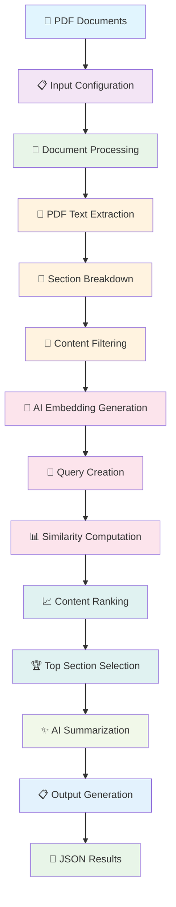
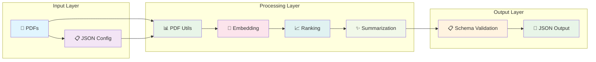
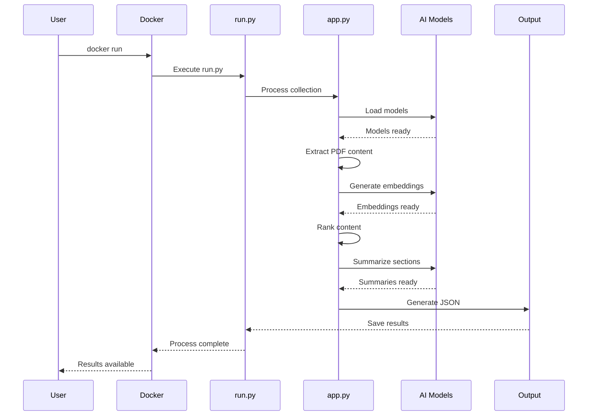

# 🚀 AI-Powered PDF Analysis Engine - 1B Challenge

> **Transform your PDF documents into intelligent insights with persona-driven analysis**

## 🌟 What This Does

This is a sophisticated AI system that analyzes PDF documents through the lens of specific personas and use cases. Think of it as having a smart assistant that reads through your documents and extracts exactly what matters to you, based on who you are and what you're trying to accomplish.

### ✨ Key Features
- **🧠 Persona-Driven Analysis**: Content is filtered and ranked based on specific user personas
- **📊 Intelligent Ranking**: Uses semantic similarity to find the most relevant sections
- **📝 Smart Summarization**: AI-powered content refinement and summarization
- **🔄 Batch Processing**: Handle multiple document collections automatically
- **📋 Structured Output**: Clean, consistent JSON results with metadata

## 🏗️ Project Structure

```
📁 1b/
├── 🐳 Dockerfile                 # Container configuration
├── 📋 requirements.txt           # Python dependencies
├── 🚀 run.py                     # Main execution script
├── 🔧 app.py                     # Core processing logic
├── 📄 schemas.py                 # Data models & validation
├── 📊 pdf_utils.py              # PDF extraction utilities
├── 🧠 embedding.py              # AI embedding generation
├── 📈 ranking.py                # Content ranking algorithm
├── 📝 summarise.py              # AI summarization engine
├── 📂 input/                    # Input documents & config
│   ├── 📋 challenge1b_input.json
│   └── 📄 *.pdf files
└── 📂 output/                   # Generated results
    └── 📋 challenge1b_output.json
```

## 🚀 Quick Start

### Using Docker (Recommended)

```bash
# Build the container
docker build -t pdf-analyzer .

# Run the analysis
docker run -v $(pwd)/input:/app/input -v $(pwd)/output:/app/output pdf-analyzer
```

### Manual Setup

```bash
# Install dependencies
pip install -r requirements.txt

# Run the analysis
python run.py
```

## 📊 How It Works

### 🔄 **Process Flow Diagram**



### 📋 **Detailed Process Steps**

#### 1. **📄 Document Processing** 
```
PDF Files → Text Extraction → Section Breakdown → Content Filtering
```
- **Input**: Multiple PDF documents
- **Tool**: `pdfplumber` for text extraction
- **Output**: Structured sections with metadata
- **Filter**: Removes empty/invalid content

#### 2. **🧠 AI-Powered Analysis**
```
Persona + Task → Query Creation → Embedding Generation → Similarity Scoring
```
- **Query**: Combines persona role + job requirements
- **Model**: `sentence-transformers` (all-MiniLM-L6-v2)
- **Process**: Generates embeddings for query and all sections
- **Scoring**: Cosine similarity computation

#### 3. **📈 Intelligent Ranking**
```
Similarity Scores → Content Ranking → Deduplication → Top Selection
```
- **Algorithm**: Cosine similarity-based ranking
- **Deduplication**: Removes duplicate sections
- **Selection**: Top 5 most relevant sections
- **Output**: Ranked list with importance scores

#### 4. **✨ Smart Summarization**
```
Top Sections → T5 Model → Content Refinement → Summary Generation
```
- **Model**: T5-small transformer
- **Process**: Tokenization → Summarization → Refinement
- **Output**: Concise, relevant summaries
- **Quality**: Maintains context and key information

### 🔧 **Technical Architecture**



### ⚡ **Performance Flow**



## 📋 Input Format

```json
{
  "challenge_info": {
    "challenge_id": "round_1b_002",
    "test_case_name": "travel_planner"
  },
  "documents": [
    {
      "filename": "document.pdf",
      "title": "Document Title"
    }
  ],
  "persona": {
    "role": "Travel Planner"
  },
  "job_to_be_done": {
    "task": "Plan a 4-day trip for 10 college friends"
  }
}
```

## 📤 Output Format

```json
{
  "metadata": {
    "input_documents": ["list of processed files"],
    "persona": "User Persona",
    "job_to_be_done": "Task description",
    "processing_timestamp": "2024-01-01T12:00:00"
  },
  "extracted_sections": [
    {
      "document": "source.pdf",
      "section_title": "Section Title",
      "importance_rank": 1,
      "page_number": 1
    }
  ],
  "subsection_analysis": [
    {
      "document": "source.pdf",
      "refined_text": "AI-generated summary",
      "page_number": 1
    }
  ]
}
```

## 🎯 Use Cases

### 🧳 Travel Planning
- **Persona**: Travel Planner
- **Task**: Plan group trips, find attractions, restaurants
- **Documents**: Travel guides, city information, cultural guides

### 👔 Business Analysis
- **Persona**: Business Analyst
- **Task**: Extract market insights, competitive analysis
- **Documents**: Reports, whitepapers, industry studies

### 📚 Academic Research
- **Persona**: Researcher
- **Task**: Literature review, data extraction
- **Documents**: Research papers, academic publications

## 🔧 Technical Stack

- **🐍 Python 3.10**: Core programming language
- **📄 pdfplumber**: PDF text extraction
- **🧠 sentence-transformers**: Semantic embeddings
- **🤗 transformers**: T5 summarization model
- **📊 scipy**: Scientific computing and similarity calculations
- **📋 pydantic**: Data validation and serialization
- **🐳 Docker**: Containerization for easy deployment

## 🚀 Performance Features

- **⚡ Optimized Models**: Uses lightweight but effective AI models
- **🔄 Batch Processing**: Handles multiple document collections
- **💾 Memory Efficient**: Processes documents in chunks
- **🎯 Smart Filtering**: Removes irrelevant content automatically

## 🔍 Troubleshooting

### Common Issues

1. **Model Download Failures**
   - Ensure stable internet connection
   - Check Docker build logs for download errors

2. **PDF Processing Issues**
   - Verify PDF files are not corrupted
   - Check file permissions in mounted volumes

3. **Memory Issues**
   - Large PDFs may require more Docker memory
   - Consider processing documents in smaller batches

## 🤝 Contributing

This project is designed for specific use cases but can be extended for:
- Additional AI models
- New document formats
- Enhanced ranking algorithms
- Custom output formats

## 📄 License

This project is designed for educational and research purposes.

---

**🎉 Ready to transform your documents into intelligent insights? Let's get started!** 
